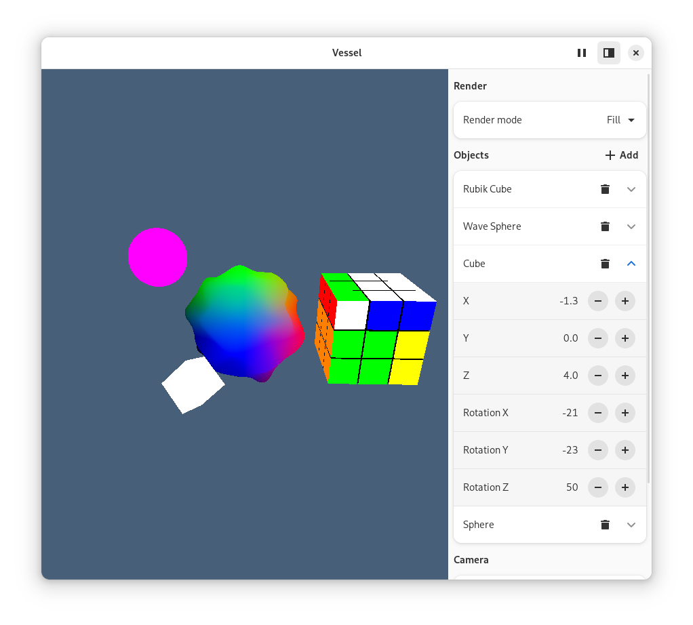

# Vessel

> [!WARNING]
> This project in early development

Simple 3D Engine made with Vala  
_Compatible with Gtk.GLArea_



## Usage

### Basic
1. Create `Vessel.Viewport` in GL context
```vala
var viewport = new Vessel.Viewport();
```
2. Add nodes to `Vessel.Node` for example `Vessel.Mesh3D`
```vala
renderer.current_scene.add_child(new Mesh3D() { mesh = new BoxMesh(1) });
```
3. Call `render` method from `Vessel.Viewport` in GL context
```vala
renderer.render();
```
4. Call `resize` method from `Vessel.Viewport` on each resize event from your GL context owner
```vala
renderer.resize(width, height);
```

## Example
Example of `Gtk.GLArea` as GL context owner are located in `example` folder

## Building

### Gnome Builder
1. Clone
2. Open in Gnome Builder
3. Click `Run Project (Shift+Ctrl+Space)`

### Manually

    $ meson setup --prefix=/usr build
    $ ninja -C build install

## Contributing

1. Fork it ( https://github.com/SpikedPaladin/Vessel/fork )
2. Create your feature branch (git checkout -b my-new-feature)
3. Commit your changes (git commit -am 'Add some feature')
4. Push to the branch (git push origin my-new-feature)
5. Create a new Pull Request
